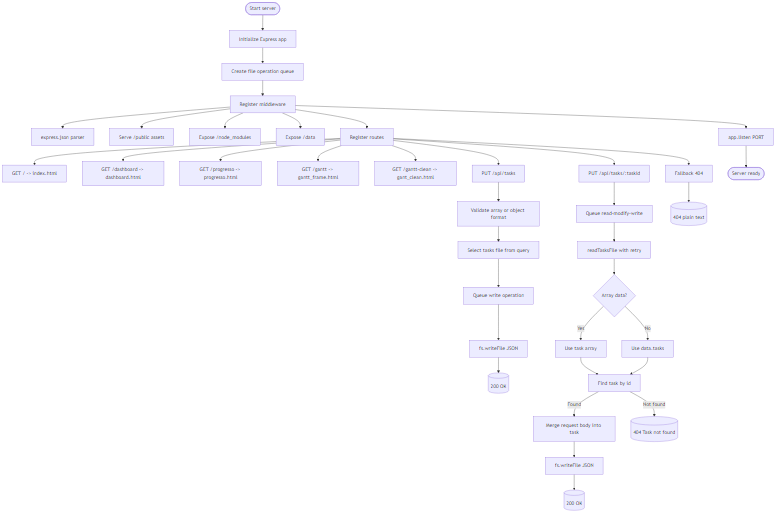
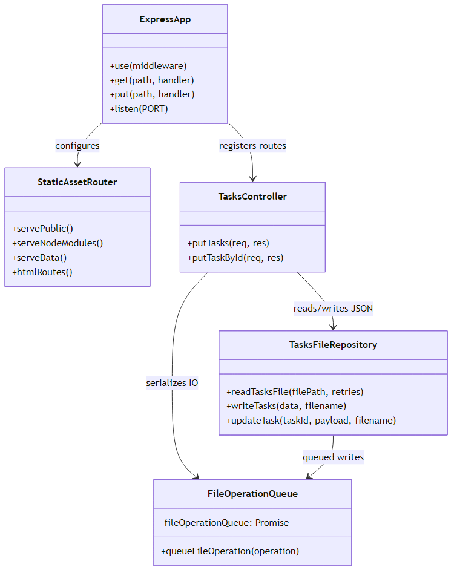
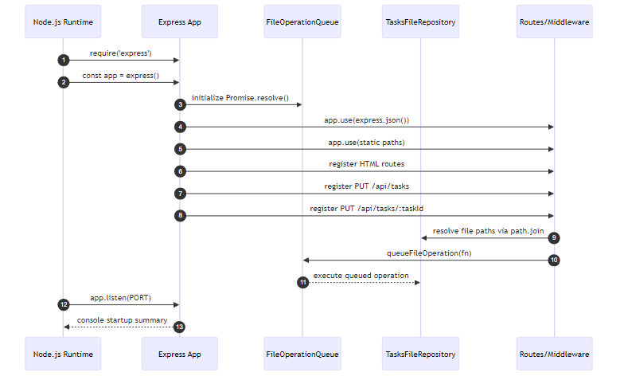
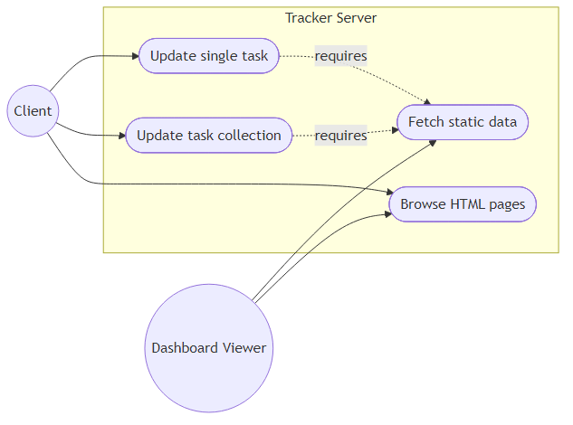

# App.js Analysis

This document analyzes `project_tracker/src/app.js`, the Express-based tracker server responsible for serving the UI bundle and persisting task data. The application focuses on deterministic file I/O, predictable routing, and reliable task updates that work with both legacy (array-only) and metadata-enriched JSON payloads.

## Runtime Flow



1. Express is instantiated and immediately wired with middleware: JSON parsing, static asset serving for `public/`, `node_modules/`, and `data/`.
2. HTML routes funnel requests to the correct document (`/`, `/dashboard`, `/progresso`, `/gantt`, `/gantt-clean`).
3. Two PUT endpoints accept either a task collection or an individual task update. Both serialize disk access through a shared promise queue to guard against race conditions.
4. A final catch-all 404 handler plus the `app.listen` startup block complete the lifecycle.

## Core Components



- **ExpressApp** – Owns middleware, HTML routes, API routes, and server startup.
- **FileOperationQueue** – Implements write serialization by chaining promises. Every mutation acquires the queue to prevent concurrent writes from corrupting JSON files.
- **readTasksFile helper** – Adds resilience by retrying disk reads and rejecting empty payloads before `JSON.parse`.
- **Tasks Controller** – Validates payload structure, locates the proper filename via `req.query.file`, merges individual updates, and emits structured success/error responses.

## Instantiation & Wiring



1. Node loads Express and constructs the `app` instance.
2. The promise-based queue is initialized (`Promise.resolve()` default state).
3. Middleware and routes are registered synchronously; each route closes over helpers such as `queueFileOperation` and `readTasksFile`.
4. When a task write is requested, the route enqueues a function that performs the actual I/O after the preceding operation finishes.
5. `app.listen` binds the server and prints a verbose startup banner describing every public route and static directory.

## Use Cases & Actors



- **Client** (e.g., dashboard editor) can browse every HTML view, update all tasks in bulk, or update a single task via `PUT /api/tasks/:taskId`.
- **Dashboard Viewer** is primarily read-only, consuming pre-generated HTML and the exposed `/data/*.json` files.
- Both mutation use cases depend on access to the JSON task store served under `/data`.

## Data Handling & Validation

- **Dual format compatibility**: The API accepts either an array (legacy) or an object with a `tasks` array plus metadata. This reduces migration friction for existing dashboards.
- **Retry semantics**: `readTasksFile` retries up to three times with a short delay, mitigating transient read glitches (e.g., momentary empty file while another process writes).
- **Task merges**: Single-task updates use shallow spreading (`{ ...existing, ...patch }`) to avoid dropping unspecified fields while still allowing targeted edits.
- **Error surfaces**: Distinct responses for invalid payloads (400), missing tasks (404), and unexpected failures (500 with message) support better client diagnostics.

## Observations & Recommendations

- Static asset routes are explicit and predictable, but consider compressing responses (e.g., `compression` middleware) if bandwidth becomes a concern.
- The queue strategy ensures consistency but can become a bottleneck if write volume grows; moving to a real datastore would improve scalability.
- No authentication is enforced, so any client with network access can modify tasks. Introduce auth or scoped API keys if the tracker is exposed beyond localhost.
- Add integration tests that simulate concurrent updates to validate queue guarantees.

## Diagram Rendering

Run the helper script to update all diagram PNG files:

```bash
cd study_docs/app_js_analysis
./render_diagrams.sh
```

The script prefers a globally installed `mmdc` but falls back to `npx @mermaid-js/mermaid-cli` to keep the tooling self-contained.
